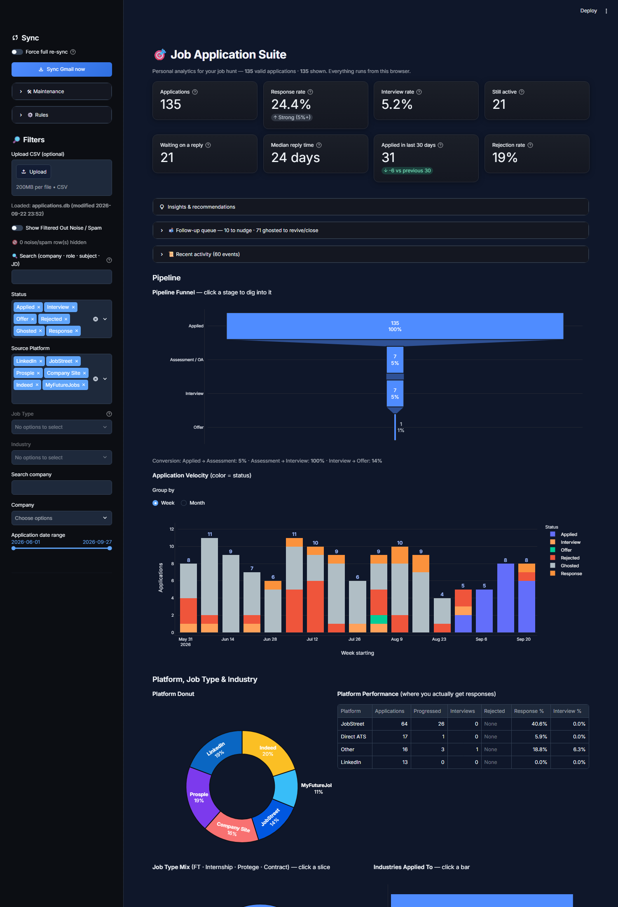

# Job Application Tracker

A personal job-application tracker: sync Gmail, filter out the noise, track every
application automatically, and read the search through visualisations benchmarked against
published hiring data.



_Screenshots run on a synthetic dataset (`demo_seed.py`) - no real application data._

```bash
launch_dashboard.bat        # or: streamlit run dashboard.py
```

Full documentation: **[docs/README.md](docs/README.md)**

## Layout

```
dashboard.py            the Streamlit app (run this)
main.py                 the sync engine (Gmail -> parse -> warehouse)

storage.py              SQLite operational store
parser.py               email parsing + the anti-noise filter
gmail_fetcher.py        Gmail API search and body fetching
auth.py                 OAuth flow and token caching
enricher.py             job-posting scraper (OpenGraph, SSRF-guarded)
repair.py               audit and repair pass over stored rows

warehouse.py            star-schema DDL + build entry point
warehouse_etl.py        ETL from the operational tables into the star schema
warehouse_queries.py    the SQL library (CTEs, window functions)
bi_export.py            Excel / Power BI (DAX) / Tableau pack

backfill_dates.py       one-off repair for last_updated semantics

tests/                  hermetic unit tests
docs/                   documentation
.streamlit/config.toml  theme + server config

demo_seed.py            synthetic dataset generator (screenshots / demos)
demo_wrapper.py         dashboard on demo.db - never touches real data
screenshots.py          README screenshot capture (Playwright)
```

Data files (created on first run, never committed):
`applications.db`, `job_tracker.csv`, `sync_state.json`, `token.json`, `credentials.json`,
`backups/`, `bi_pack/`.

## Quick start

1. `pip install -r requirements.txt`
2. Double-click `launch_dashboard.bat`
3. Click **Sync Gmail now**

## Data architecture (star schema)

Grain (what one row means):

| Table | Grain |
|---|---|
| `fact_application` | one row per job application |
| `fact_status_event` | one row per status change (append-only event log) |
| `fact_application_skill` | one row per application x skill (bridge) |

```
  dim_date (marked date table)   dim_company   dim_platform   dim_status
          \                          |              |             /
           \                         |              |            /
            +-----------------> fact_application <--------------+
                                     |
          dim_role_family            |          dim_skill
          dim_seniority              v
          dim_industry        fact_status_event
          dim_job_type                |
                                      v
                               fact_application_skill

  reporting view: vw_application_analysis (denormalised, safe to import into
  Power BI / Tableau in one step)
```

**Four surfaces, one metric definition:** `warehouse_queries.py` computes every metric
once in SQL (CTEs, window functions). The Streamlit dashboard and the Excel exports read
those results; `bi_export.py` ships the matching DAX measures and Tableau calculated
fields written against the same tables and validated to agree - so the dashboard, the
workbook, the Power BI report and the Tableau view cannot drift apart. Unknown values
stay NULL everywhere (never zero-filled).

## Tests

```bash
run_tests.bat
# or: venv\Scripts\python.exe -m unittest discover -s tests
```
